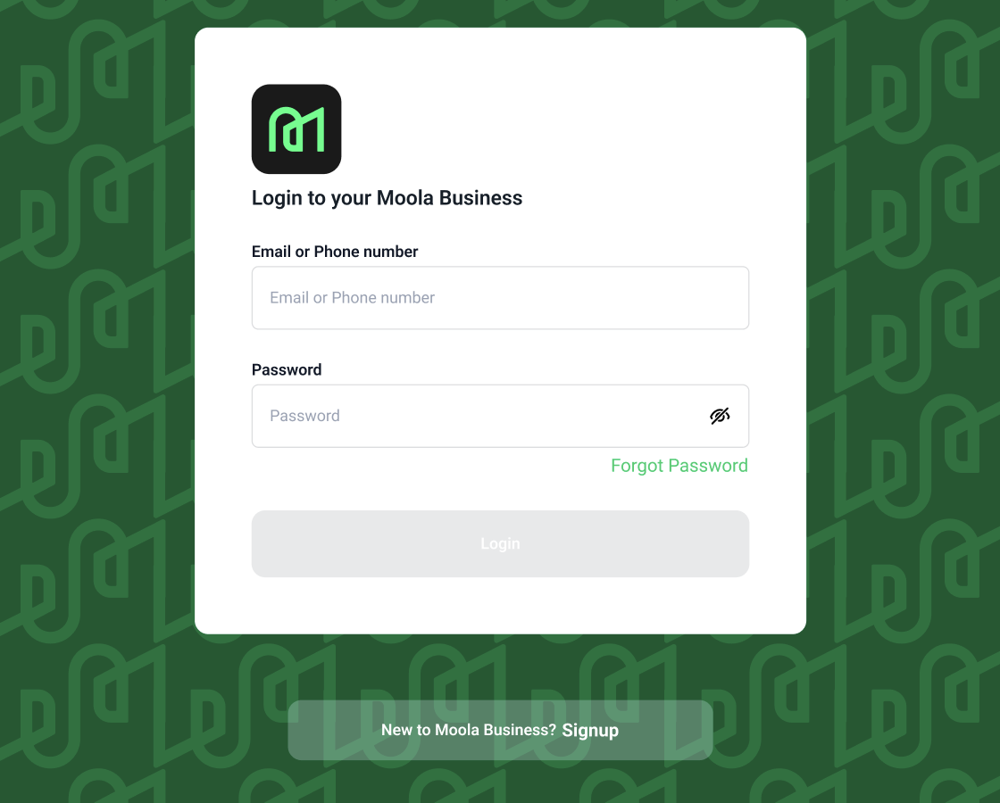

<h1>Moola Web (Merchant) Application</h1>
<h6><i>Manage your Moola Web Application</i></h6>

# Technologies 

 + [NextJs](https://nextjs.org/)
 + [React TanStack Query](https://tanstack.com/query/latest)  
 + [TailwindCss](https://tailwindcss.com/) 
 + [React Hook-form](https://react-hook-form.com/) 
 + [Github Actions](https://docs.github.com/en/actions/)

# Prototype

 
# How to Contribute

1. Clone the repository
 `git clone https://github.com/TotalSecure-Ng/moola-web-bussiness.git`
            

2. Change directory into the `cloned folder ` and run the setup script 
 `cd  moola-web-bussiness`

3. Open your terminal and type this command `npm install ` to add the react dependency to the app in the development mode.

4. After the Successful installation of the  dependency type/copy this command  `npm run dev` to run the app in your local environment 

5. Copy this link  [http://localhost:3000/](http://localhost:3000/) and paste it to your web browser(Chrome, safari, mozilla firefox et.c) to view it.

# Deployment
Vercel was used to deploy the app. 
 + [Vercel](https://vercel.com/dashboard)

# License
The MIT License - Copyright (c) 2024 - Present, Total Secure / Storage Service.

# Author
Rasheed Olatunde (Software Developer)